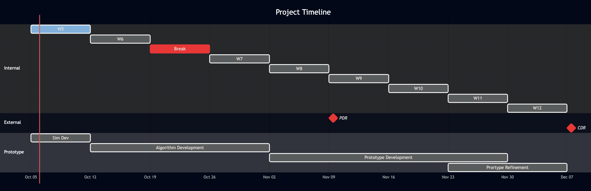

# 🔎 Scanning

## 📃 1. Description

A 3D Scanning Pipeline for the Amputee's Stump based on camera data to improve Robotic Arm socket confort. It is compromised of different tools:

1. A **Simulating Platform** on Blender
2. A **3D Reconstruction Pipeline** on Python

## ♻️ 2. Simulating Platform

### 2.1. Contents

In this platform you will find:

- **add-ons/**: In this folder there is the list of needed blender add-ons to run the simuaton file. Inside you will find the add-on for **BlenderNeRF**. To understand how to use this pipeline resort to:
- **simulated_frames/**: In this folder tou will find various datasets of stump pictures that were generated with the blender simulating platform with varying number of degrees (cameras)
  - _dataset_d90.zip_ - Dataset of stump images taken with 90º degrees step (4 images)
  - _dataset_d60.zip_ - Dataset of stump images taken with 60º degrees step (6 images)
  - _dataset_d30.zip_ - Dataset of stump images taken with 30º degrees step (12 images)
- **3d_scanning_sim.blend**: In this file you will find the full enviroment used to generate the previous datasets

### 2.2. How Use?

To generate a new image first you will need to:

1. Load the BlenderNeRF add-on onto your blender enviroment: Edit > Preferences > Add-ons > Install from Disk > `BlenderNeRF.zip`.
2. Configure your camera radius: CameraPath (object) > Item (Panel) > Dimensions and change both x and y dimensions to best fit your needs.
3. Configure your AABB to fit everything (camera and stump): AABB_Wire (Object) > Item (Panel) > Dimensions (x,y and z)
4. Configure your dataset general settings: BlenderNeRF (Panel) > BlenderNeRF shared UI  
   4.1. There you adjust the AABB size  
   4.2. Also check Render Frames and Save Logs as you will need both for the 3D Reconstruction  
   4.3. Select NeRF file format  
   4.4.efine the Save path
5. Configure your dataset specific settings: BlenderNeRF (Panel) > Subset of Frames SOF  
   5.1. Select the step value (the inbetween angle of every frame)  
   5.2. Update the dataset name
6. Run the Simualtion: BlenderNeRF (Panel) > Subset of Frames SOF >PLAY SOF
7. Run the script: `intrinsic.py` to extract the matrix K

## 🖇️ Requirements

- If exterior software is used, is must be open source — or at least easily accessible without constraints
- Simple scanning procedure, that doesn’t require very specific material
- The scan should be doable by a pair of two people (amputee and helper)
- End goal: Run the scanning algorithm on the mobile application

## ⏱️ Timeline

### Week 5 (Current Week):

- [x] To have a simulation platform that can generate stereo pictures (by defining a number of available angles)
  - [x] Learn to script in Blender
  - [x] Add the scene to Blender (with 3D stump)
  - [ ] Add the angle configuration to script
  - [x] Generate a 4 angle run
  - [x] Generate a 8 angle run
  - [x] Generate a 16 angle run
  - [x] Generate a 360 angle run

###  ⚠️ Week 6:

- [ ] Build the first algorithm
- [ ] Have the break to support with this, maybe the learning curve could limit this

###  Week 7:

- [ ] Have a second algorithm with a comparison to pick the best
  - [ ] Maybe the first algorithm works more as a proof of concept
- [ ] Or start on the first physical prototype
  - [ ] Need to define multiple cameras or a rotating system

###  Week 8:

- [ ] If went with 2 model -> start to build prototype
  - [ ] Most likely
  - [ ] Have the 3d model of the cameras mount
  - [ ] Have the cameras requested by now (and decided on the schema)
- [ ] If not -> Finish and refine prototype for PDR
  - [ ] May need 3d printing training, may be to generous of a deadline
